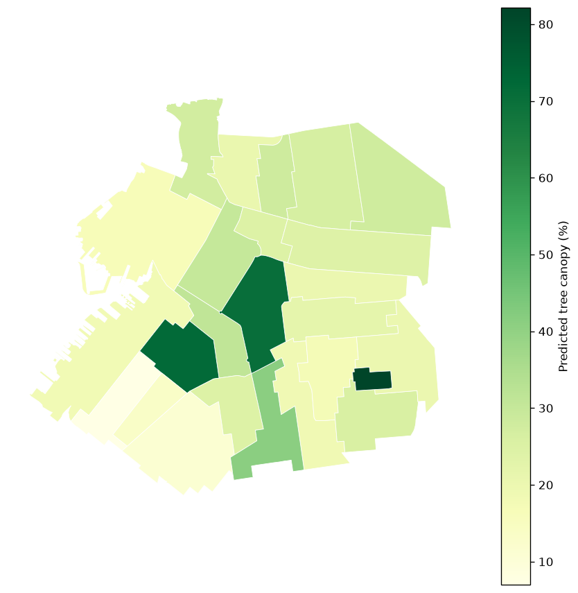
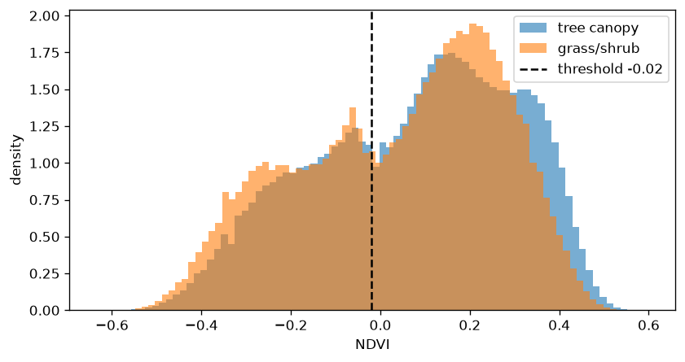
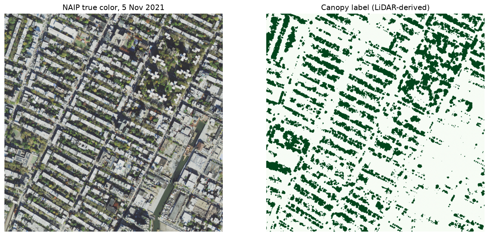

# NYC Tree Canopy Segmentation

Finding tree canopy in aerial imagery with a Random Forest pixel classifier,
validated against
New York City's LiDAR-derived land cover data.

**Result:** the model reaches **0.54 IoU** on held-out imagery, against
**0.49** for an NDVI threshold. The gap is structural: NDVI measures greenness,
and this imagery was flown on 5 November 2021, when some crowns had turned and
some hadn't.

**[Live map](https://<you>.github.io/nyc-canopy-segmentation/)**



## The question

Tree canopy affects summer heat, stormwater, and air quality, and it's spread
unevenly across NYC. Mapping it accurately normally needs aircraft LiDAR, which
is expensive and flown rarely. Can a model read canopy from ordinary aerial
photography instead?

## Data

| | Source | Resolution | Date |
|---|---|---|---|
| Imagery (input) | USDA NAIP, RGB + NIR | 0.6 m | 5 Nov 2021 |
| Labels | NYC land cover, TNC / UVM, LiDAR-derived | 0.15 m | 2021 |
| Boundaries | NYC Neighborhood Tabulation Areas | — | 2020 |

Labels come from laser-measured height, the input is optical. Different sensors,
same year — so the model isn't re-deriving something already extracted from its
own input.

Study area: Park Slope, Brooklyn. 4.9 km square, 1024 chips of 256×256 px.

## Method

1. **Align.** Reproject labels onto the imagery's exact pixel grid
   (`Resampling.mode`, since land cover is categorical).
2. **Split geographically.** Left 60% train, middle 20% validation, right 20%
   test. Random splits leak on imagery — adjacent tiles share trees, shadows and
   sun angle, so a memorising model scores well without generalising.
3. **Baseline.** NDVI threshold, tuned on train only, frozen, applied to test.
4. **Model.** A Random Forest classifier on 7 per-pixel features — the four
   NAIP bands, NDVI, and local variance at two window sizes.

## Results

| Method | IoU | Precision | Recall |
|---|---|---|---|
| NDVI threshold | 0.40 | 0.65 | 0.66 |
| Random Forest | 0.54 | 0.65 | 0.76 |

At neighbourhood scale, predicted canopy percent tracks the reference within
**4.7 percentage points** mean absolute error.

### Why NDVI struggles here



November imagery makes canopy spectrally bimodal — green crowns score high,
turned crowns low — and it overlaps grass, which stays green into December. No
single threshold separates them. The Random Forest does better because texture
features distinguish canopy structurally — mown grass is spectrally similar to
canopy but uniform pixel-to-pixel, while crowns have internal shadow and gaps at
0.6 m resolution.

### A false lead worth mentioning

Missed canopy pixels initially showed a negative median NDVI — not just low,
which vegetation cannot produce. Investigation ruled out mode-resampling
artifacts and label misregistration (a local shift-test found no offset that
improved IoU beyond noise level, under 0.005). The actual cause: narrow
street-tree canopy has far more edge relative to area than solid forest blocks,
so mixed edge pixels average toward the surrounding pavement or roofline. It's
a property of the canopy's shape, not a processing error.

### Alignment check



## Notebooks

| | |
|---|---|
| [01 — Data prep](notebooks/01_data_prep.ipynb) | Align labels, cut chips |
| [02 — Baseline](notebooks/02_baseline.ipynb) | Spatial split, NDVI, errors |
| [03 — Classifier](notebooks/03_random_forest.ipynb) | Random Forest, feature importances |
| [04 — Results](notebooks/04_results_and_map.ipynb) | Inference, zonal stats, map |

## Limitations

- One study area, one date. Nothing here shows it generalises.
- Labels are themselves a model, not ground truth — reported at 99% per-pixel
  accuracy for canopy, but not perfect.
- Autumn imagery: the model learned partly-turned crowns and would likely need
  retraining on summer imagery.
- Each pixel is classified independently from its own features, so the model has
  no notion of crown shape or connectivity — a single bright pixel in a parking
  lot can be called canopy with no neighbouring context to veto it.

## Reproduce

Runs on macOS or Windows. No GPU needed.

**1. Environment**

```bash
conda env create -f environment.yml
conda activate canopy
python -m ipykernel install --user --name canopy
```

Keep the kernel name as `canopy` — the notebooks reference it by that name in
their metadata.

**2. Folders**

macOS:
```bash
mkdir -p data/raw data/interim/chips data/processed figures docs
```

Windows:
```bash
mkdir data data\raw data\interim data\interim\chips data\processed figures docs
```

**3. Point VS Code at the environment** — two separate settings:

- Command palette (Cmd/Ctrl+Shift+P) → *Python: Select Interpreter* → the one
  showing `canopy`. This covers `.py` files.
- Open a notebook → kernel picker, top right → **Python (canopy)**. Notebooks
  don't inherit the interpreter choice above.

Verify in a cell — the path should contain `envs/canopy`:

```python
import sys; print(sys.executable)
```

**4. Data** — download into `data/raw/`:

- [NYC land cover 2021](https://zenodo.org/records/14053441) (1.7 GB)
- NAIP 2021 tile (USGS EarthExplorer or NOAA Digital Coast)
- NYC 2020 Neighborhood Tabulation Areas (GeoJSON, NYC Open Data)

Filenames must match `src/config.py`.

**5. Run** notebooks 01 → 04 in order.

## Licence

Code: MIT. Derived data and map: CC BY-NC-SA 4.0, inherited from the land cover
source. See [DATA_LICENSE.md](DATA_LICENSE.md).